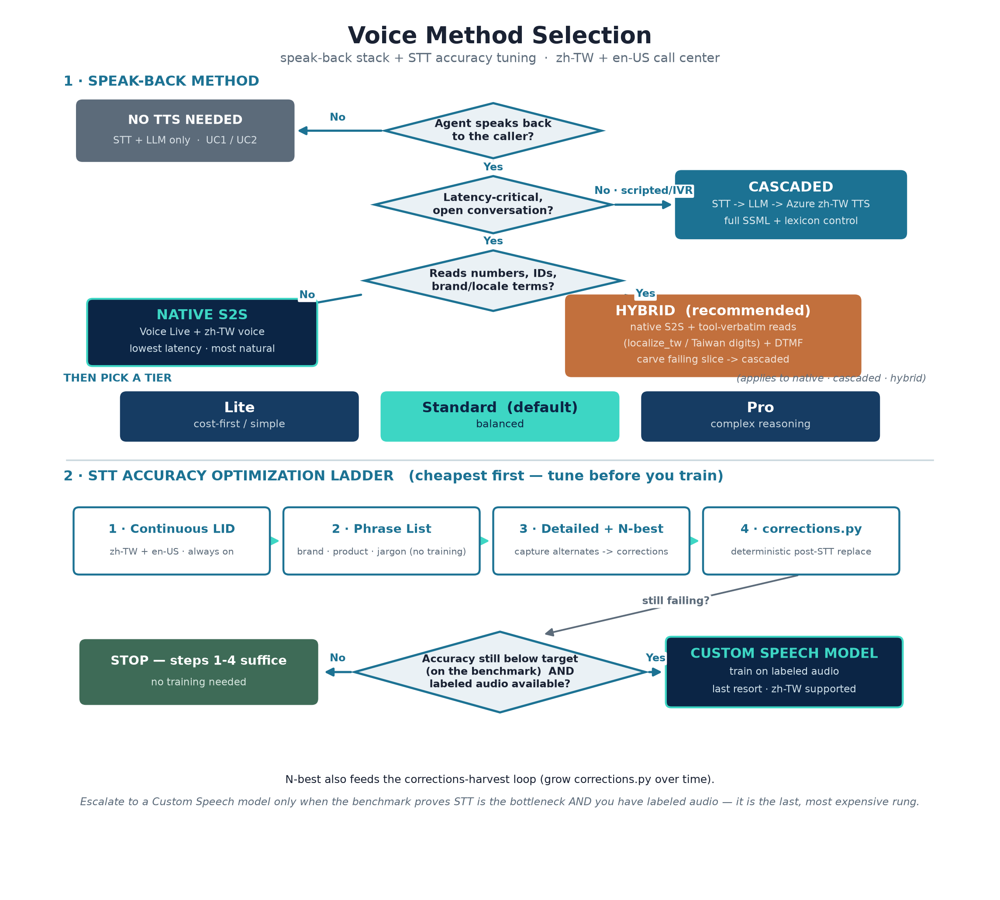
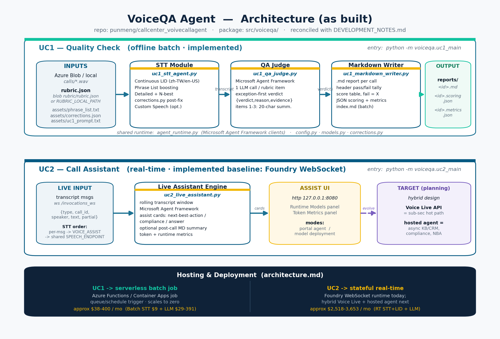

# Architecture

This document covers the **design concept** (how to choose voice tech), the **per-case architecture** (UC1/UC2/UC3), and the **working process**.

## Visual diagrams

Updated design visuals from the docs/images and spec folders:

- Voice method selection: [../spec/Voice_Method_Selection.png](../spec/Voice_Method_Selection.png)
- End-to-end architecture: [images/VoiceQA_Architecture_current.png](images/VoiceQA_Architecture_current.png)





---

## 1. Design concept — scenario-driven selection

Principle used with customers: **do not pick technology by model/API name alone** — start from the business problem and interaction pattern, then choose the layer.

Microsoft's post-Build-2026 voice stack has three layers:

1. **Model** — Whisper · MAI-Transcribe · MAI-Voice-1 · MAI-Voice-2 · GPT-4o Realtime / gpt-realtime
2. **Service** — Azure Speech Service · Azure OpenAI Realtime API
3. **Orchestration platform** — **Voice Live API** (a managed `STT + LLM + TTS` runtime, not a single model)

Recommended design order: **(1) business outcome** (lower AHT, higher first-call resolution, shorter training) → **(2) interaction type** (offline transcription, real-time dialog, voice agent, telephony) → **(3) model/service/platform**.

### Capability matrix (reference, zh-TW)

| 項目 | Azure Speech API | Whisper | MAI-Transcribe | GPT-4o Realtime | Voice Live API | MAI-Voice-1 | MAI-Voice-2 |
|---|---|---|---|---|---|---|---|
| 類型 | Service | Model | Model | Model + API | Managed Service | Model | Model |
| STT | ✅ | ✅ | ✅ | ✅ | ✅ | ❌ | ❌ |
| TTS | ✅ | ❌ | ❌ | ✅ | ✅ | ✅ | ✅ |
| Speech-to-Speech | ❌ | ❌ | ❌ | ✅ | ✅ | ❌ | ❌ |
| LLM 推理 | ❌ | ❌ | ❌ | ✅ | 可選 GPT/Phi | ❌ | ❌ |
| Tool Calling | ❌ | ❌ | ❌ | ✅ | ✅ | ❌ | ❌ |
| 多輪記憶 | ❌ | ❌ | ❌ | ✅ | ✅ | ❌ | ❌ |
| 電話中心 | ACS 整合 | ❌ | ❌ | ACS 搭配 | ACS 原生整合 | ❌ | ❌ |
| WebSocket / WebRTC | ✅ / ❌ | 部分 | 部分 | ✅ / ✅ | ✅ / ✅ | ❌ | ❌ |

One-liner mapping: Azure Speech = voice components · GPT-4o Realtime = real-time dialog model · Voice Live API = enterprise voice-agent platform · MAI-Transcribe/MAI-Voice = underlying STT/TTS model families.

---

## 2. UC1 architecture — batch quality check

```
              ┌──────────────────────────────────────────────────────────────┐
              │               VoiceQA Agent (voiceqa.uc1_main)              │
              │   STT → Judge → Markdown, per call recording                 │
              └────┬───────────────────────┬───────────────────────┬─────────┘
                   ▼                       ▼                       ▼
        ┌───────────────────┐   ┌─────────────────────┐   ┌────────────────────┐
        │   STT Module      │   │   QA Judge Module   │   │  Markdown Writer   │
        │   uc1_stt_agent   │   │   uc1_qa_judge      │   │  uc1_markdown_writer│
        │ • Continuous LID  │   │ • Rubric from sheet │   │ • One .md per call │
        │ • PhraseList      │   │ • Per-item async    │   │ • Header tally     │
        │ • Detailed+N-best │   │   judging           │   │ • ❌ on 不符合 rows │
        │ • corrections.py  │   │ • Exception-first   │   │ • 逐字稿 appended  │
        │ • Custom Speech   │   │   verdict logic     │   │ • index.md roll-up │
        └───────────────────┘   └─────────────────────┘   └────────────────────┘
```

### STT tuning ladder (cheapest/safest first)
1. **Continuous LID** for `zh-TW` + `en-US` code-switching (always on).
2. **Phrase List** — boost brand names, product codes, jargon.
3. **Detailed output + N-best capture** — feeds the corrector, surfaces alternates.
4. **`assets/corrections.json` + `src/voiceqa/corrections.py`** — deterministic post-STT string replacement.
5. **Custom Speech model** — last resort; requires labeled audio.

### QA judging strategy
- One LLM call per rubric item, parallelized with `asyncio.Semaphore(4)`, temperature 0.
- Structured JSON per item: `{verdict, reason, evidence_quote}`; items 1–3 use `{summary}` (≤20 字).
- Exception-first verdict priority: exception clause → apply; else match clause → `符合`; else → `不符合` + reason.

### Markdown output rules
One `.md` per call with a header table (案例編號, 音檔, 時長, 符合/不符合 tally), a 摘要 section (items 1–3), and a 評分明細 table (判定結果 + 判定原因 + 佐證); `不符合` rows flagged with ❌; 逐字稿 appended (optional); batch runs also emit `index.md`.

---

## 3. UC2 architecture — real-time assistant (hybrid target)

Core principle: **keep the orchestration loop off the sub-second hot path.**

```
 Telephony / call line                 HOT PATH (sub-second)                Agent screen
 ┌──────────────────┐   audio    ┌────────────────────────────────┐  guidance  ┌────────────┐
 │ active line N     │ ────────▶ │ Azure Voice Live API           │ ─────────▶ │ Assist UI  │
 │ (streaming)       │           │  (integrated speech + LLM)     │            │            │
 └──────────────────┘           └───────────────┬────────────────┘            └────────────┘
                                  rolling transcript │ (async, ≤1–2s tolerated)
                                                     ▼
                                       ┌────────────────────────────┐
                                       │ Hosted Agent (async assist)│
                                       │ KB/CRM · compliance · NBA   │
                                       └────────────────────────────┘
```

- **Hot path → Azure Voice Live API** (integrated low-latency speech + LLM for turn-by-turn interaction).
- **Async assist → hosted/managed agent** (retrieval, compliance, next-best-action) — tolerates 1–2s, kept off the latency-critical path.
- Current repo baseline: Foundry WebSocket real-time assistant (`voiceqa.uc2_main`); the hybrid above is the recommended next step.

---

## 4. UC3 architecture — automated voice agent

Where UC2 *assists* a human agent, **UC3 is the agent**: a fully automated speech-to-speech voice bot with three selectable pipelines.

```
 Caller (browser)          Backend (uc3_voice_agent)              Azure services
 ┌──────────────┐  PCM16   ┌──────────────────────────┐          ┌────────────────────┐
 │ mic + player  │ ──ws──▶ │ pipeline dispatcher       │ ───────▶ │ Voice Live          │
 │ method select │ ◀─ws──  │  ?pipeline=voicelive|      │ ◀─────── │  gpt-realtime       │
 └──────────────┘  audio   │   voicelive-tts|classic    │  events  │  (STT+LLM[+TTS])    │
                           └───────────┬────────────────┘          └────────────────────┘
                                       │ tools: query_billing / query_it_support / escalate_to_expert
                                       ▼                            ┌────────────────────┐
                              ┌────────────────────┐   classic path │ Azure Speech STT/TTS│
                              │ Foundry agents      │ ─────────────▶ │ (Recognizer /       │
                              │ billing / IT / expert│                │  Synthesizer)       │
                              └────────────────────┘                └────────────────────┘
```

| Pipeline | Listen | Think | Speak | Tool handoffs | Trade |
|---|---|---|---|---|---|
| `voicelive` | Voice Live | Voice Live `gpt-realtime` | Voice Live | ✅ | Lowest latency, fully bundled; least TTS control. |
| `voicelive-tts` | Voice Live | Voice Live `gpt-realtime` (text-only) | Azure Speech TTS (SSML) | ✅ | Keeps fast STT+reasoning; adds pronunciation control + cheaper TTS. |
| `classic` | Azure Speech STT | Foundry chat model | Azure Speech TTS | ❌ | No Voice Live dependency; cheapest think step; plain conversation. |

The hot path stays on Voice Live for STT + reasoning (same principle as UC2); Foundry agents run *off* the hot path for authoritative billing/IT/account answers (`allow_preview=True` for knowledge grounding). See [UC3.md](UC3.md) for full detail.

---

## 5. Hosting & deployment

The right runtime differs by case: **UC1 is a stateless batch pipeline; UC2/UC3 are stateful, latency-sensitive real-time services.** A hosted/managed agent runtime only earns its keep on the real-time cases.

- **UC1 → serverless batch job** (Azure Functions or Container Apps job, queue/schedule-triggered, scales to zero). A hosted agent here is unused overhead.
- **UC2/UC3 → hybrid / WebSocket service** (Azure Container Apps or App Service). Keep a full managed-agent orchestration loop **off** the speech hot path; use it for async retrieval/handoffs that tolerate 1–2s.

**Tradeoff:** a managed agent buys less infra code + built-in state/tools/observability, at the cost of higher per-call latency/cost and less control. For offline batch (UC1) that's all downside; for stateful live services (UC2/UC3) it's mostly upside — except on the latency-critical hot path, which belongs on Voice Live.

---

## 6. Working process

1. Define scenario and business outcome.
2. Select use-case path (UC1 batch / UC2 assist / UC3 agent).
3. Run the entrypoint (`start_uc1.ps1` / `start_uc2.ps1` / `start_uc3.ps1`, or `start_voice_ui.ps1`).
4. Run a benchmark (`start_stt_benchmark_matrix.ps1` / `start_tts_benchmark_matrix.ps1`) for quality/cost comparison — see [BENCHMARKS.md](BENCHMARKS.md).
5. Review outputs under `reports/` and `reports/benchmarks/<run-id>/`.
6. Update design/cost docs when assumptions or architecture change.

**Expansion:** use `catalog/` as the control plane (`voice_catalogs.yaml`, `use_cases/*.yaml`, `methods/*.yaml`, `templates/`). See [DEVELOPMENT.md](DEVELOPMENT.md).
</content>
