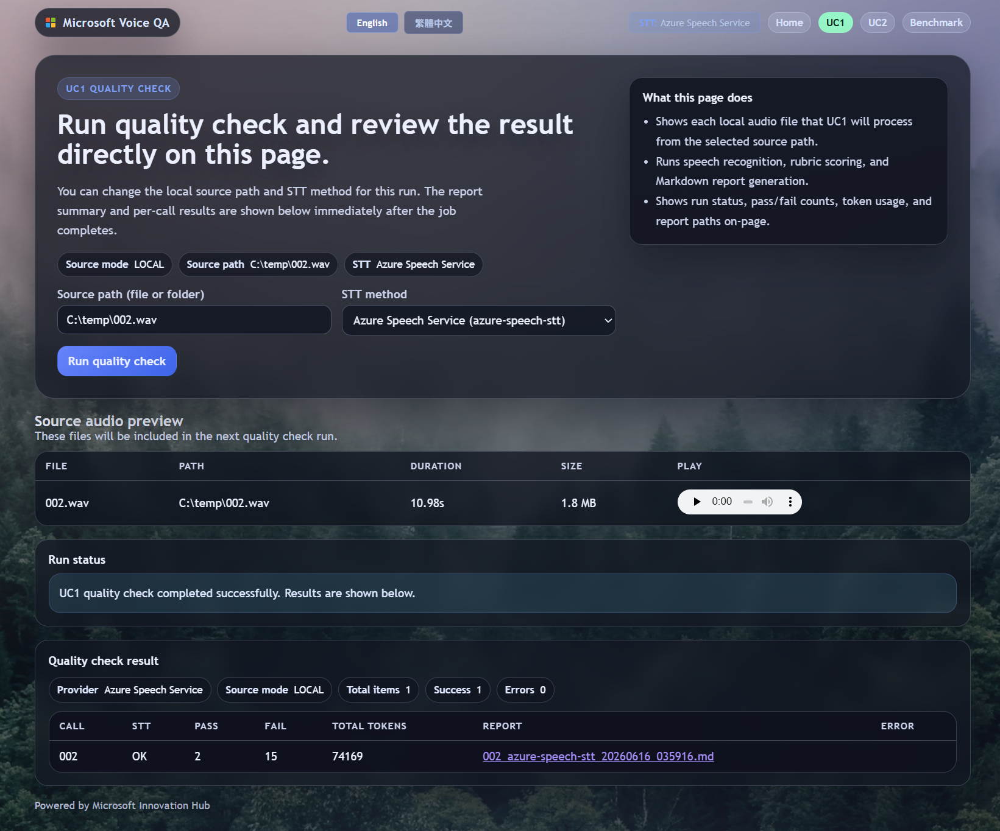
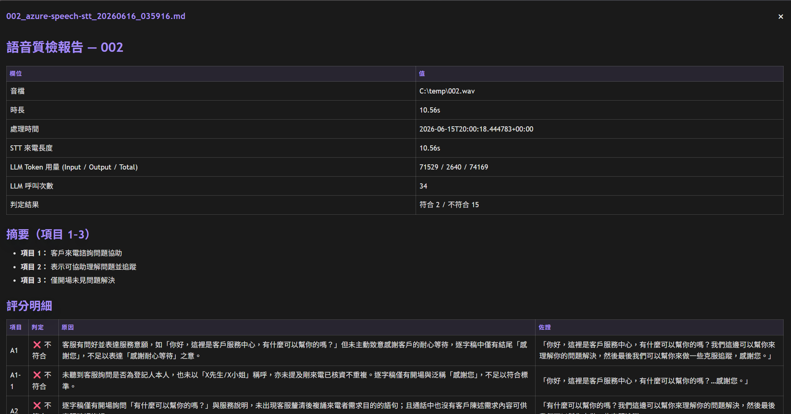

# UC1 Code - Blob Audio to Markdown QA Report

Current build version: `v1.0.0`

This implementation follows your UC1 spec and now uses a shared Microsoft Agent Framework runtime helper:

- Blob audio input from Azure Blob Storage
- Optional local audio input from filesystem path or folder
- STT tuned with Azure Speech optimization ladder
  - Continuous language ID (`zh-TW`, `en-US`)
  - Phrase list boosting
  - Detailed output + N-best capture
  - Post-STT corrections via `assets/corrections.json`
  - Optional custom speech endpoint ID
- LLM rubric judging with exception-first logic, now via Microsoft Agent Framework
- Markdown report output per call, plus optional `index.md`

## Screenshots

UC1 quality-check page (consolidated dashboard):



Generated QA report view:



## Voice optimization skills

UC1 stacks the following Azure Speech optimization techniques to maximize transcription accuracy on mixed zh-TW + English call audio (implemented in [../src/voiceqa/uc1_stt_agent.py](../src/voiceqa/uc1_stt_agent.py)):

| Skill | What it does | Where to configure |
| --- | --- | --- |
| Continuous Language ID | Auto-detects zh-TW vs en-US per utterance with `AutoDetectSourceLanguageConfig`, so code-switching mid-call is handled. | `SPEECH_LANGUAGES` env var or `[uc1].languages` in `config/stt_config.toml`. |
| Speaker diarization | `ConversationTranscriber` tags each turn with a speaker id, separating agent vs customer in the report. | Provider `azure-speech-stt` in `[uc1]`. |
| Phrase list boosting | Loads domain terms / product names from a phrase list to bias recognition toward expected vocabulary. | `assets/phrase_list.txt` (`PHRASE_LIST_PATH`); toggle with `[uc1].phrase_list`. |
| Detailed output + word timestamps | Requests `Detailed` output, word-level timestamps, and word-level corrections for richer scoring evidence. | Always on in UC1. |
| N-best capture | Stores the top-3 alternative hypotheses per segment for downstream review. | Always on in UC1. |
| Post-STT corrections | Regex-based canonicalization of known mis-hearings (e.g. brand names) after recognition. | `assets/corrections.json` (`CORRECTIONS_PATH`). |
| Custom Speech model | Optionally routes to a fine-tuned Custom Speech endpoint for domain-specific acoustics/vocabulary. | `SPEECH_CUSTOM_ENDPOINT_ID`. |
| Pluggable STT provider | Swap the STT engine (real-time SDK, fast SDK, REST fast-transcription, MAI-Transcribe, GPT audio, Custom Speech) without code changes. | `[uc1].provider` in `config/stt_config.toml`. |

## 1. Setup

```powershell
python -m venv .venv
.\.venv\Scripts\Activate.ps1
pip install -r requirements.txt
```

Copy `.env.example` to `.env` and fill in values.

## 2. Run

```powershell
$env:PYTHONPATH = "src"
python -m voiceqa.uc1_main
```

## 3. Required env vars

- `BLOB_ACCOUNT_URL`, `BLOB_CONTAINER_IN`, `BLOB_CONTAINER_OUT`
- Speech auth (choose one):
  - `SPEECH_KEY` + `SPEECH_REGION`, or
  - `SPEECH_KEY` + `SPEECH_ENDPOINT`, or
  - `SPEECH_ENDPOINT` only (Entra ID / `az login`, no key)
- `AOAI_API_KEY`, `AOAI_ENDPOINT`, `AOAI_DEPLOYMENT`

If you want local account login (Entra ID) instead of API key for Azure OpenAI:

- Run `az login` locally first.
- Set `AOAI_USE_ENTRA_ID=true`.
- Keep `AOAI_ENDPOINT`, `AOAI_DEPLOYMENT`, `AOAI_API_VERSION`.
- `AOAI_API_KEY` can be empty in this mode.

UC1 now uses Microsoft Agent Framework for the judge step. It still accepts the same Azure OpenAI-style inputs, but the runtime is built on the Agent Framework OpenAI client.

`AOAI_ENDPOINT` supports either:

- Classic Azure OpenAI endpoint: `https://<resource>.openai.azure.com`
- New v1 endpoint: `https://<resource>.openai.azure.com/openai/v1`

Optional:

- `INPUT_SOURCE`: `blob` (default) or `local`
- `INPUT_BLOB_NAME` for one file
- `INPUT_PREFIX` for batch
- `LOCAL_AUDIO_PATH` for one local file when `INPUT_SOURCE=local`
- `LOCAL_AUDIO_DIR` for local batch folder when `INPUT_SOURCE=local`
- `RUBRIC_LOCAL_PATH` to load rubric JSON from local filesystem
- `OUTPUT_TO_BLOB` (`true`/`false`) to control blob upload of reports
- `INCLUDE_TRANSCRIPT` (`true`/`false`)
- `JUDGE_CONCURRENCY` (default `4`)
- `PHRASE_LIST_PATH`, `CORRECTIONS_PATH`
- `SPEECH_CUSTOM_ENDPOINT_ID`

## 4. Rubric format

`RUBRIC_BLOB_PATH` should point to JSON like:

```json
{
  "items": [
    {"id": "1", "type": "summary", "criteria": "開場白摘要"},
    {"id": "A1", "type": "verdict", "criteria": "...", "exception": "..."}
  ]
}
```

## 5. Output

- Local: `reports/<call_id>.md`
- Blob output container: `<call_id>.md`
- Batch mode: also emits `reports/index.md` and `index.md` in output container

## 6. Local audio examples

Single local file:

```powershell
$env:INPUT_SOURCE = "local"
$env:LOCAL_AUDIO_PATH = "C:\\recordings\\call_001.wav"
$env:PYTHONPATH = "src"
python -m voiceqa.uc1_main
```

Dashboard note:

- When using the consolidated dashboard (`start_voice_ui.ps1`), UC1 now supports source audio preview with inline audio playback and direct report viewing in modal.

## 7. Foundry portal agent example

If you want UC1 to show up in the Foundry portal as a real agent resource, use the portal-agent settings below:

- Foundry project endpoint:
  `https://ai-speech-alexpun-resource.services.ai.azure.com/api/projects/ai-speech-alexpun`
- Foundry agent name:
  `voicecall-uc1-judge`
- Foundry agent version:
  `1`

Set:

```powershell
$env:FOUNDRY_PROJECT_ENDPOINT = "https://ai-speech-alexpun-resource.services.ai.azure.com/api/projects/ai-speech-alexpun"
$env:FOUNDRY_AGENT_NAME = "voicecall-uc1-judge"
$env:FOUNDRY_AGENT_VERSION = "1"
$env:SPEECH_ENDPOINT = "<your-azure-speech-endpoint>"
```

UC1 now prefers the portal agent path when `FOUNDRY_AGENT_NAME` is set. If you leave those settings out, it falls back to the older Foundry model-deployment client or Azure OpenAI path.

Reusable runbook for create/update is here: `P9_UC1_FOUNDRY_AGENT_PROCEDURE.md`.

Legacy OpenAI endpoint example:

```powershell
$env:AOAI_ENDPOINT = "https://ai-speech-alexpun-resource.openai.azure.com/openai/v1"
$env:AOAI_DEPLOYMENT = "<your-deployment-name>"
$env:AOAI_API_VERSION = "2024-10-21"
```

### Keyless example (local account login)

```powershell
az login
$env:AOAI_USE_ENTRA_ID = "true"
$env:AOAI_ENDPOINT = "https://ai-speech-alexpun-resource.openai.azure.com/openai/v1"
$env:AOAI_DEPLOYMENT = "<your-deployment-name>"
$env:AOAI_API_VERSION = "2024-10-21"
```

Speech keyless example (local account login):

```powershell
az login
$env:SPEECH_KEY = ""
$env:SPEECH_ENDPOINT = "https://<your-speech-resource>.cognitiveservices.azure.com/"
```

Fully local mode example (no blob required for rubric/output):

```powershell
$env:INPUT_SOURCE = "local"
$env:LOCAL_AUDIO_PATH = "C:\\temp\\001.wav"
$env:RUBRIC_LOCAL_PATH = "C:\\Code\\VoiceCall Verify\\assets\\rubric.json"
$env:OUTPUT_TO_BLOB = "false"
$env:PYTHONPATH = "src"
python -m voiceqa.uc1_main
```

Local folder batch:

```powershell
$env:INPUT_SOURCE = "local"
$env:LOCAL_AUDIO_DIR = "C:\\recordings\\daily"
$env:PYTHONPATH = "src"
python -m voiceqa.uc1_main
```
