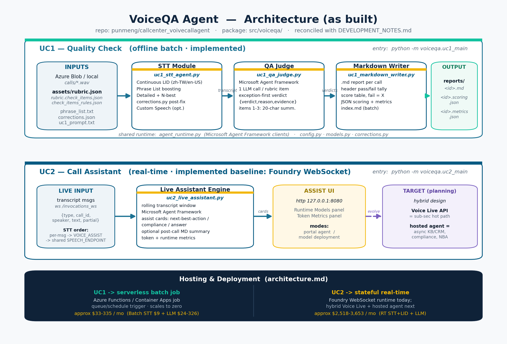

# VoiceCall Verify

This repository contains two related implementations for mixed zh-TW + English call-center audio.

## Version

- Current build version: `v1.0.0`

## Quick start

```powershell
python -m venv .venv
.\.venv\Scripts\Activate.ps1
pip install -r requirements.txt
az login
```

## What the current code does

### UC1 - Blob Audio to Markdown QA Report

UC1 is the implemented batch pipeline. It:

- reads audio from Azure Blob Storage or local files
- transcribes the audio with Azure AI Speech
- applies phrase list tuning and post-STT corrections
- sends the transcript through a Microsoft Agent Framework judge
- scores the transcript against the rubric
- writes a Markdown QA report plus JSON scoring artifacts

The batch entrypoint is `python -m voiceqa.uc1_main`.

### UC2 - Real-time Call Assistant

UC2 is the real-time assistant path. It:

- accepts live transcript events over a Foundry hosted-agent WebSocket
- keeps a rolling transcript window per call session
- uses Microsoft Agent Framework to produce assist cards
- supports next-best-action, compliance, and answer suggestions
- can emit an optional post-call Markdown summary
- reports STT mode, LLM mode, token usage, and cumulative audio duration in the built-in UI

The hosted-agent entrypoint is `python -m voiceqa.uc2_main`.

### Consolidated Web UI

The consolidated dashboard is a separate web entrypoint that brings UC1, UC2, and the benchmark page together in one place.

- `python -m voiceqa.web_ui`
- `start_voice_ui.ps1`

It provides:

- a home page with the use-case list, value statement, and STT model in use
- separate UC1 and UC2 pages
- a benchmark page that summarizes all runs from `reports/benchmarks`
- language switcher (English and Traditional Chinese) with browser persistence
- audio preview player in UC1 and Benchmark source tables

Notes:

- The dashboard no longer exposes separate `/uc1/config` and `/uc2/config` pages.
- `start_voice_ui.ps1` auto-selects an available local port when `PORT` is not set.

## Key files

- [../src/voiceqa/uc1_main.py](../src/voiceqa/uc1_main.py) - UC1 orchestration
- [../src/voiceqa/uc1_stt_agent.py](../src/voiceqa/uc1_stt_agent.py) - Azure Speech transcription
- [../src/voiceqa/uc1_qa_judge.py](../src/voiceqa/uc1_qa_judge.py) - Agent Framework judge used by UC1
- [../src/voiceqa/uc2_live_assistant.py](../src/voiceqa/uc2_live_assistant.py) - UC2 live assistant logic
- [../src/voiceqa/web_ui.py](../src/voiceqa/web_ui.py) - consolidated UC1/UC2/benchmark dashboard
- [../src/voiceqa/agent_runtime.py](../src/voiceqa/agent_runtime.py) - shared Agent Framework client setup
- [../src/voiceqa/uc1_markdown_writer.py](../src/voiceqa/uc1_markdown_writer.py) - Markdown report generation
- [../agent.yaml](../agent.yaml) - Foundry hosted-agent metadata for UC2

## Run UC1

```powershell
$env:PYTHONPATH = "src"
python -m voiceqa.uc1_main
```

UC1 uses settings copied from [../.env.example](../.env.example) into local `.env` for Speech, storage, and model access.

## Run UC2 locally

```powershell
$env:PYTHONPATH = "src"
python -m voiceqa.uc2_main
```

UC2 uses the Foundry agent runtime and the `VOICE_ASSIST_*` environment variables in [../.env.example](../.env.example).

## Baseline scope checklist

- 2 call-center use cases: `UC1` + `UC2`
- 1 benchmark method: `STT_BENCHMARK.md` + `scripts/eval_stt_quality.py`
- 1 voice design concept: `VOICE_USE_CASES_DESIGN_CONCEPT.zh-TW.md`
- cost estimate for both UCs: `cost_estimate.md` (Case 1 + Case 2)

## Repository organization

- [REPO_ORGANIZATION.md](REPO_ORGANIZATION.md)
- [PROCESS_SUMMARY.md](PROCESS_SUMMARY.md)
- [../catalog/README.md](../catalog/README.md)
- [../catalog/voice_catalogs.yaml](../catalog/voice_catalogs.yaml)

## Traditional Chinese docs

- [README.zh-TW.md](README.zh-TW.md)
- [README_UC1.zh-TW.md](README_UC1.zh-TW.md)
- [README_UC2.zh-TW.md](README_UC2.zh-TW.md)
- [VOICE_USE_CASES_DESIGN_CONCEPT.zh-TW.md](VOICE_USE_CASES_DESIGN_CONCEPT.zh-TW.md)

## Architecture diagram



## Repository docs

- [DEVELOPMENT_NOTES.md](DEVELOPMENT_NOTES.md)
- [../src/voiceqa/uc1_main.py](../src/voiceqa/uc1_main.py)
- [../src/voiceqa/uc1_qa_judge.py](../src/voiceqa/uc1_qa_judge.py)
- [../src/voiceqa/uc1_stt_agent.py](../src/voiceqa/uc1_stt_agent.py)
- [../src/voiceqa/uc1_markdown_writer.py](../src/voiceqa/uc1_markdown_writer.py)
- [../src/voiceqa/uc1_blob_reader.py](../src/voiceqa/uc1_blob_reader.py)
- [../src/voiceqa/uc2_main.py](../src/voiceqa/uc2_main.py)
- [../src/voiceqa/uc2_live_assistant.py](../src/voiceqa/uc2_live_assistant.py)
- [README_UC1.md](README_UC1.md)
- [README_UC2.md](README_UC2.md)
- [scope.md](scope.md)
- [architecture.md](architecture.md)
- [design_spec_uc1_blob_to_md.md](design_spec_uc1_blob_to_md.md)
- [design_spec_uc2_realtime_assistant.md](design_spec_uc2_realtime_assistant.md)
- [STT_BENCHMARK.md](STT_BENCHMARK.md)
- [VOICE_USE_CASES_DESIGN_CONCEPT.zh-TW.md](VOICE_USE_CASES_DESIGN_CONCEPT.zh-TW.md)
- [REPO_ORGANIZATION.md](REPO_ORGANIZATION.md)
- [PROCESS_SUMMARY.md](PROCESS_SUMMARY.md)
