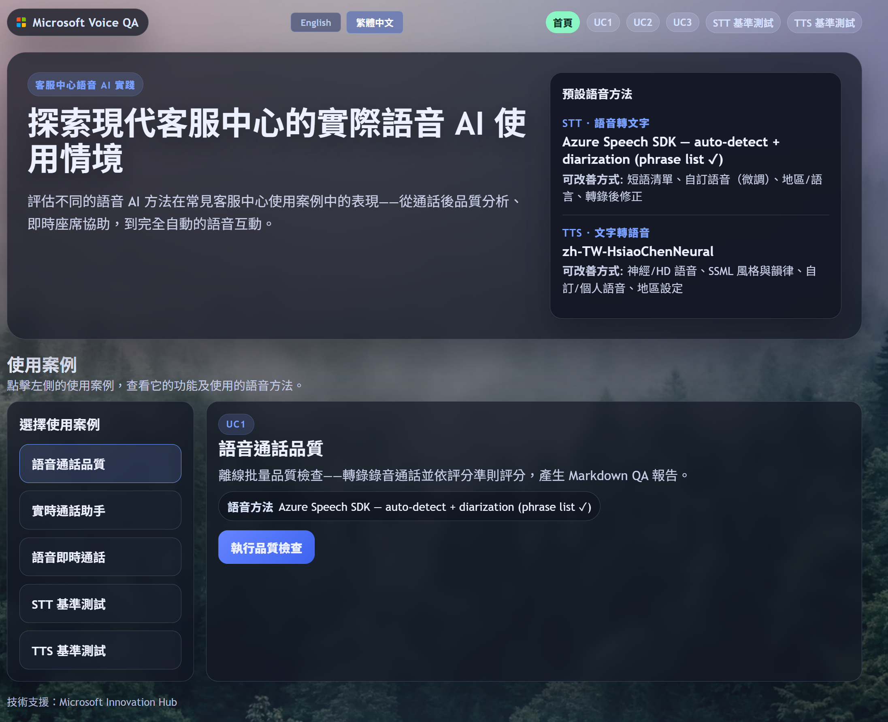

# VoiceCall Verify：語音方法選型與最佳實務（繁體中文）

這是一份面向中英夾雜（zh-TW + English）客服語音 AI 的實戰手冊：協助你依情境選擇 STT/LLM/TTS 方法、用基準測試比較取捨，並落地到三種 UC 管線。版本請見 [../VERSION](../VERSION)。

> UC1 = 離線品質評分 · UC2 = 真人客服即時輔助 · **UC3 = AI 直接擔任客服**。

方法優先重點：
- 依場景選方法（批次 QA、即時輔助、全自動語音代理）。
- 以 STT/TTS 基準結果優化品質、延遲與成本。
- 透過管線層控制策略（Voice Live 一體化、Voice Live + 可控 TTS、classic STT->LLM->TTS）。

## 快速開始

```powershell
python -m venv .venv
.\.venv\Scripts\Activate.ps1
pip install -r requirements.txt
az login
.\start_voice_ui.ps1   # 未設定 PORT 時自動挑選可用埠
```



## 視覺圖表

- 語音方法選型圖： [../spec/Voice_Method_Selection.png](../spec/Voice_Method_Selection.png)
- 端到端架構圖： [../spec/VoiceQA_Architecture-v1.png](../spec/VoiceQA_Architecture-v1.png)

## 三個使用案例

| | UC1 — 品質檢核 | UC2 — 通話輔助 | UC3 — 語音代理 |
|---|---|---|---|
| **時機** | 通話後（批次） | 通話中（即時） | 通話中（即時） |
| **角色** | 評分客服 | 輔助真人客服 | **擔任**客服 |
| **輸入** | 音檔 blob / 本機檔 | 即時逐字稿 / 麥克風 | 來電者麥克風 |
| **輸出** | Markdown 品質報告 | 畫面輔助卡片 | 合成語音回覆 |
| **入口** | `python -m voiceqa.uc1_main` | `python -m voiceqa.uc2_main` | `start_uc3.ps1`（或 `/uc3/live`） |

三者共用同一套 **Azure 語音能力 + Agent Framework 執行環境**；實際 STT/TTS 路徑會依使用案例與管線選擇而不同（例如 UC3 可選 Voice Live STT 或 Azure Speech STT）。

## 主要檔案

- [../src/voiceqa/uc1_main.py](../src/voiceqa/uc1_main.py) — UC1 主程式
- [../src/voiceqa/uc1_stt_agent.py](../src/voiceqa/uc1_stt_agent.py) — UC1 語音轉文字
- [../src/voiceqa/uc1_qa_judge.py](../src/voiceqa/uc1_qa_judge.py) — UC1 判定邏輯
- [../src/voiceqa/uc2_live_assistant.py](../src/voiceqa/uc2_live_assistant.py) — UC2 即時助理
- [../src/voiceqa/uc3_voice_agent.py](../src/voiceqa/uc3_voice_agent.py) — UC3 語音代理（三種管線 + 專家交接）
- [../src/voiceqa/agent_runtime.py](../src/voiceqa/agent_runtime.py) — 共用 Agent Runtime
- [../catalog/voice_catalogs.yaml](../catalog/voice_catalogs.yaml) — 能力矩陣 / 擴充控制層

## 文件索引（英文為主）

- 總覽：[README.md](README.md)
- 架構與設計概念：[ARCHITECTURE.md](ARCHITECTURE.md)
- 使用案例：[UC1.md](UC1.md) · [UC2.md](UC2.md) · [UC3.md](UC3.md)
- 基準測試（STT + TTS）：[BENCHMARKS.md](BENCHMARKS.md)
- 成本估算：[COST.md](COST.md)
- 開發說明：[DEVELOPMENT.md](DEVELOPMENT.md)
- 變更記錄：[CHANGELOG.md](CHANGELOG.md)
</content>
