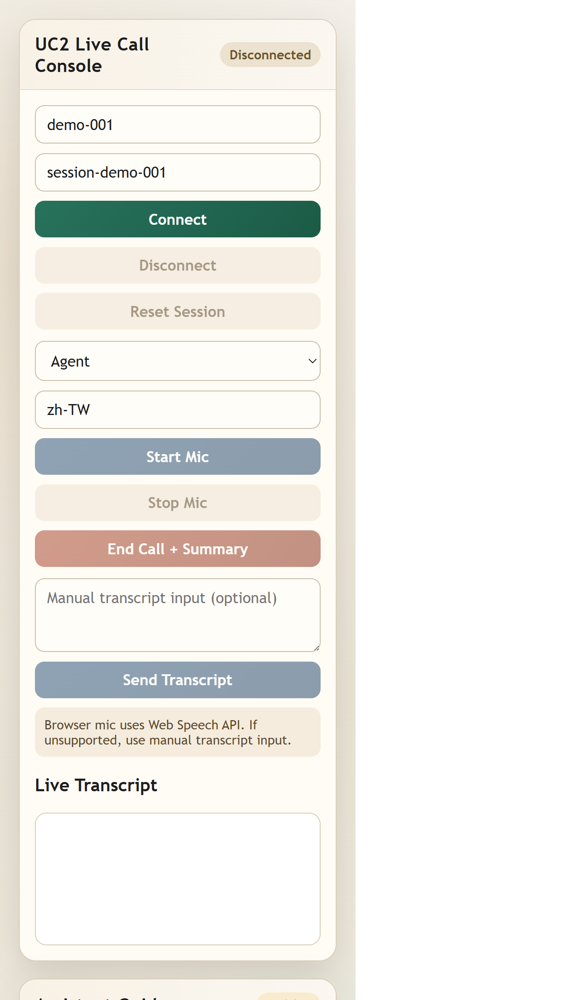

# UC2 Real-Time Assistant

UC2 is the live call-assistant path. It uses Microsoft Agent Framework and Foundry runtime settings, while keeping UC1 batch processing unchanged.

## What UC2 does

- Receives live transcript messages over the WebSocket endpoint `/invocations_ws`.
- Generates compact assist cards for agent guidance.
- Supports optional post-call summary generation.
- Reports runtime and usage metrics in the built-in UI.

## Runtime modes

UC2 supports two runtime modes:

1. Portal agent mode (recommended)
	- Set `VOICE_ASSIST_AGENT_NAME` and `VOICE_ASSIST_AGENT_VERSION`.
2. Model deployment mode
	- Set `VOICE_ASSIST_MODEL_DEPLOYMENT_NAME` (or fallback deployment variables).

## Local setup

```powershell
python -m venv .venv
.\.venv\Scripts\Activate.ps1
pip install -r requirements.txt
az login
```

Required environment values:

- `VOICE_ASSIST_PROJECT_ENDPOINT`
- Either portal-agent values (`VOICE_ASSIST_AGENT_NAME`, `VOICE_ASSIST_AGENT_VERSION`) or deployment value (`VOICE_ASSIST_MODEL_DEPLOYMENT_NAME`)

Optional compatibility values accepted by runtime:

- `FOUNDRY_VOICE_ASSIST_AGENT_NAME`
- `FOUNDRY_VOICE_ASSIST_AGENT_VERSION`

## Run

```powershell
$env:PYTHONPATH = "src"
python -m voiceqa.uc2_main
```

Server default:

- HTTP UI: `http://127.0.0.1:8080/`
- WebSocket: `ws://127.0.0.1:8080/invocations_ws`

## Screenshot



## Startup checklist

- `az login` is successful.
- `.env` contains valid `VOICE_ASSIST_*` settings.
- UC2 server is running on port `8080`.
- Browser can open `http://127.0.0.1:8080/`.
- Click Connect in UI and verify connection status is `Connected`.

## Built-in UI metrics

Runtime Models panel:

- STT mode label
- LLM/Foundry model label

Token Metrics panel:

- STT mode
- LLM mode
- Cumulative audio duration (seconds)
- LLM request count
- Session total tokens (input/output/total)
- Last request tokens (input/output/total)

STT mode resolution order in UC2:

1. Per-message `stt_service` in payload
2. `VOICE_ASSIST_STT_SERVICE`
3. Shared `SPEECH_ENDPOINT` (same endpoint UC1 uses)

Reusable build runbook:

- `docs/UC2_FOUNDRY_AGENT_PROCEDURE.md`

## Message shape

Example transcript message:

```json
{
  "type": "transcript",
  "call_id": "001",
  "speaker": "agent",
  "text": "...",
  "partial": false
}
```

Response includes `status`, `cards`, optional `summary_markdown`, plus runtime and token metric fields consumed by the UI.