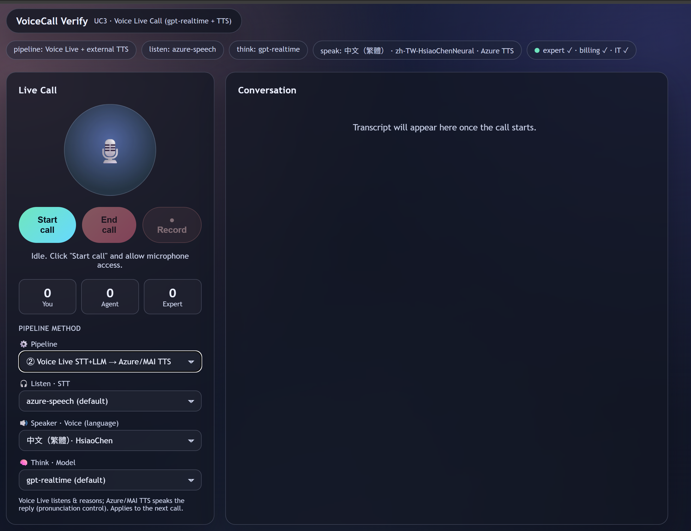

# UC3 — Voice Live Call (automated voice agent)

UC3 is a **fully automated AI voice agent** that talks directly to the caller. By default it uses the Azure AI Voice Live API with a `gpt-realtime` session to do speech-to-speech (STT + LLM + TTS) in one realtime connection, and hands specific inquiries to Foundry **billing / IT / expert** agents before speaking the answer back.

> UC1 = offline QA scoring · UC2 = live coaching for a human agent · **UC3 = the AI *is* the agent**.



## Contents
1. [Pipelines](#1-pipelines)
2. [What UC3 does](#2-what-uc3-does)
3. [Architecture](#3-architecture)
4. [Agent handoffs](#4-agent-handoffs)
5. [Pronunciation control](#5-pronunciation-control)
6. [Session configuration](#6-session-configuration)
7. [Recording](#7-recording)
8. [Run & environment variables](#8-run--environment-variables)
9. [Files & security](#9-files--security)

---

## 1. Pipelines

Pick per call from the UI to trade latency ↔ cost ↔ pronunciation control:

| Pipeline | Listen (STT) | Think (LLM) | Speak (TTS) | Use it when |
|---|---|---|---|---|
| **`voicelive`** (default) | Voice Live | Voice Live `gpt-realtime` | Voice Live | Lowest latency, fully bundled speech-to-speech. |
| **`voicelive-tts`** | Voice Live | Voice Live `gpt-realtime` (**text-only output**) | **Azure Speech TTS** (SSML) | You need pronunciation control (e.g. read "101" as "1-0-1") while keeping Voice Live's fast STT + reasoning + tool handoffs. |
| **`classic`** | Azure Speech STT | Foundry chat model | Azure Speech TTS | No Voice Live dependency; cheapest "think" step; plain conversation (no tool handoffs). |

### Method selection and optimization code map

Use this table to jump from behavior to implementation quickly.

| What you want to adjust | Code entry point |
|---|---|
| Pipeline dropdown options and per-call query params (`pipeline`, `transcription`, `voice`, `model`) | [../assets/uc3_voice_call_ui.html](../assets/uc3_voice_call_ui.html) (`#selPipeline`, `#selListen`, `#selSpeak`, `#selThink`, `wsUrl()`) |
| Backend pipeline dispatch (`voicelive`, `voicelive-tts`, `classic`) | [../src/voiceqa/uc3_voice_agent.py](../src/voiceqa/uc3_voice_agent.py) (`create_app` -> `audio_ws_endpoint`) |
| Allow-list validation for per-call method overrides | [../src/voiceqa/uc3_voice_agent.py](../src/voiceqa/uc3_voice_agent.py) (`_UC3_MODEL_OPTIONS`, `_UC3_TRANSCRIPTION_OPTIONS`, `_UC3_VOICE_OPTIONS`, `_resolve_*`) |
| Voice Live session configuration (modalities, VAD, tools, transcription model/language) | [../src/voiceqa/uc3_voice_agent.py](../src/voiceqa/uc3_voice_agent.py) (`_handle_voice_ws`, `RequestSession(...)`) |
| Classic pipeline STT -> LLM -> TTS path | [../src/voiceqa/uc3_voice_agent.py](../src/voiceqa/uc3_voice_agent.py) (`_handle_voice_ws_classic`, `_run_classic_llm`, `_classic_stream_pcm`) |
| Pronunciation control rules (for Voice Live+external-TTS and Classic) | [../src/voiceqa/uc3_voice_agent.py](../src/voiceqa/uc3_voice_agent.py) (`_apply_speech_control`, `_build_ssml`, `_synthesize_controlled`) |
| Agent handoff tools and routing (`billing` / `IT` / `expert`) | [../src/voiceqa/uc3_voice_agent.py](../src/voiceqa/uc3_voice_agent.py) (`_handle_function_call`, `_run_billing`, `_run_it`, `_run_expert`) |
| UI startup sync to server defaults (prevents accidental override) | [../assets/uc3_voice_call_ui.html](../assets/uc3_voice_call_ui.html) (`initFromServer()`, `selectOrAdd()`) |

### Voice optimization quick playbook

1. **Pick pipeline by target**
    - Lowest latency demo: `voicelive`
    - Pronunciation + still fast: `voicelive-tts`
    - Lowest run cost: `classic`
2. **Tune speaking behavior**
    - Edit digit/readout logic in `_apply_speech_control`.
    - Add SSML controls (`<break>`, `<prosody>`, `<phoneme>`) in `_build_ssml`.
3. **Tune recognition path**
    - Change default STT model in `UC3_TRANSCRIPTION_MODEL`.
    - Keep UI/server aligned through `/health` sync (`initFromServer`).
4. **Tune reasoning cost/latency**
    - Switch `selThink` (`gpt-realtime` vs `gpt-4o-realtime-preview`) on Voice Live pipelines.
    - On `classic`, change `FOUNDRY_MODEL_DEPLOYMENT_NAME`.

---

## 2. What UC3 does

- Captures your microphone in the browser and streams PCM16 (24 kHz) audio to the backend.
- Runs the selected pipeline with server-side turn detection (barge-in on the Voice Live paths).
- Plays synthesized voice replies back in the browser; shows a live transcript, method badges (listen / think / speak), and metrics.
- Escalates specific questions to Foundry agents via function tools: `query_billing`, `query_it_support`, `escalate_to_expert` — then reads the answer aloud.
- **Record** button saves a mixed mic+agent WAV into UC1's source folder for quality-checking.

---

## 3. Architecture

```
 Caller (browser)          Backend (uc3_voice_agent)              Azure services
 ┌──────────────┐  PCM16   ┌──────────────────────────┐          ┌────────────────────┐
 │ mic + player  │ ──ws──▶ │ pipeline dispatcher       │ ───────▶ │ Voice Live          │
 │ method select │ ◀─ws──  │  ?pipeline=voicelive|      │ ◀─────── │  gpt-realtime       │
 └──────────────┘  audio   │   voicelive-tts|classic    │  events  │  (STT+LLM[+TTS])    │
                           └───────────┬────────────────┘          └────────────────────┘
                                       │ tools: query_billing / query_it_support / escalate_to_expert
                                       ▼                            ┌────────────────────┐
                              ┌────────────────────┐   classic path │ Azure Speech STT/TTS│
                              │ Foundry agents      │ ─────────────▶ │ (Recognizer /       │
                              │ billing / IT / expert│                │  Synthesizer)       │
                              └────────────────────┘                └────────────────────┘
```

- The browser streams **PCM16 mono 24 kHz** frames over `/audio_ws`. The chosen pipeline is passed as query params (`pipeline`, `transcription`, `voice`, `model`), validated against allow-lists.
- **`voicelive`** — frames go to the Voice Live `input_audio_buffer`; server VAD auto-creates responses; `response.audio.delta` chunks stream back and play via Web Audio.
- **`voicelive-tts`** — session runs **text-only** (`modalities=[TEXT]`); the final `response.text.done` is synthesized by Azure Speech TTS with SSML control (`_synthesize_controlled`) and streamed back as PCM.
- **`classic`** — frames feed an Azure Speech `SpeechRecognizer`; each final utterance runs a Foundry chat agent; the reply is synthesized with Azure Speech TTS. No Voice Live, no tool handoffs.
- On load, the UI syncs its method dropdowns to `/health` so it never silently overrides the deployed config; changing a dropdown overrides just the next call.

---

## 4. Agent handoffs (voicelive / voicelive-tts)

The Voice Live session registers **three function tools**:

| Tool | Args | Routed to |
|---|---|---|
| `query_billing` | `{ question, account_ref? }` | Foundry billing agent (bill amount, invoice, due date) |
| `query_it_support` | `{ question, category }` (`software-rd`/`hardware-rd`/`oa`) | Foundry IT agent |
| `escalate_to_expert` | `{ question, topic }` | Foundry expert agent (account / payment / order-status) |

Per call the backend: (1) emits `expert_handoff` (with an `agent` label) to the UI, (2) runs the Foundry agent via `build_foundry_agent(..., allow_preview=True)` so portal **knowledge/File-search grounding** works, (3) returns the answer as a `FunctionCallOutputItem`, (4) triggers `response.create` so the model speaks the answer (text-only + Azure TTS in `voicelive-tts`). If an agent is not configured, a spoken fallback keeps the call alive.

> **Knowledge grounding:** portal agents only ground on the *preview* path (`allow_preview=True`). Leave `UC3_*_AGENT_VERSION` unset to pin the latest version, since attaching knowledge in the portal creates new versions.

> Handoffs run on the Voice Live pipelines. `classic` is a plain STT→LLM→TTS conversation without tool calling.

---

## 5. Pronunciation control (voicelive-tts / classic)

When Azure Speech TTS speaks the reply, `_apply_speech_control(text)` builds SSML. The default wraps runs of 2+ digits in `<say-as interpret-as="digits">` (so `101` → "1-0-1", `0800` → "0-8-0-0"). This is the single customization point — refine the regex (e.g. keep currency amounts cardinal) or add `<phoneme>`/pauses. `_build_ssml` wraps it with the selected voice and `VOICE_LIVE_TRANSCRIPTION_LANGUAGE`.

---

## 6. Session configuration (Voice Live)

| Setting | `voicelive` | `voicelive-tts` |
|---|---|---|
| model | `gpt-realtime` (`UC3_VOICE_LIVE_MODEL` / `AZURE_VOICELIVE_MODEL`) | same |
| modalities | audio + text | **text only** |
| voice | `zh-TW-HsiaoChenNeural` (`UC3_VOICE_LIVE_VOICE` / `AZURE_VOICELIVE_TTS_VOICE`) | used by Azure TTS |
| input/output audio | PCM16, 24 kHz | PCM16 in; Azure TTS PCM out |
| turn detection | `server_vad` (create_response + interrupt_response) | same |
| transcription | `UC3_TRANSCRIPTION_MODEL` (default `azure-speech`), language `VOICE_LIVE_TRANSCRIPTION_LANGUAGE` (default `zh-TW`) | same |
| tools | `query_billing`, `query_it_support`, `escalate_to_expert` | same |

UI method selectors send `transcription` / `voice` / `model` overrides, validated in `_resolve_transcription_model` / `_resolve_voice` / `_resolve_model`; unknown values fall back to env defaults.

**Voice options (Speak):** the Speaker dropdown offers Azure neural voices (`zh-TW-HsiaoChenNeural`, `zh-CN-XiaoxiaoNeural`, `en-US-JennyNeural`, `en-US-AvaNeural`, `ja-JP-NanamiNeural`, `ko-KR-SunHiNeural`) plus **MAI-Voice-2** voices (`en-US-Harper:MAI-Voice-2`, `zh-CN-Mei:MAI-Voice-2`). MAI voices render through Azure Speech TTS, so they apply only to the `voicelive-tts` and `classic` pipelines and are hidden for the all-in-one `voicelive` pipeline.

---

## 7. Recording

The **Record** button toggles `ConversationRecorder`, which mixes mic (uplink) + agent (downlink) PCM16 into one mono WAV and saves it to UC1's source folder (`UC3_RECORDING_DIR` or the shared local-audio dir) as `uc3_call_<ts>.wav` — ready to quality-check with UC1.

---

## 8. Run & environment variables

```powershell
# standalone
.\start_uc3.ps1
# from the dashboard: .\start_voice_ui.ps1 -> open the UC3 tab (served at /uc3/live)
```
Click **Start call**, allow microphone access, and speak.

**Required:** `AZURE_VOICELIVE_ENDPOINT`; `AZURE_VOICELIVE_API_KEY` *(or use `az login` for `AzureCliCredential`)*.

**Optional (Voice Live):** `AZURE_VOICELIVE_API_VERSION` (default `2026-06-01-preview`), `UC3_VOICE_LIVE_MODEL` (default `gpt-realtime`), `UC3_VOICE_LIVE_VOICE` (default `zh-TW-HsiaoChenNeural`), `UC3_TRANSCRIPTION_MODEL` (default `azure-speech`; e.g. `gpt-4o-transcribe`), `VOICE_LIVE_TRANSCRIPTION_LANGUAGE` (default `zh-TW`), `UC3_WELCOME`, `UC3_RECORDING_DIR`.

**Agents (optional; `FOUNDRY_PROJECT_ENDPOINT` required for any):**
- Billing: `UC3_BILLING_AGENT_NAME` (+ `UC3_BILLING_AGENT_VERSION`) or `UC3_BILLING_MODEL_DEPLOYMENT_NAME`
- IT: `UC3_IT_AGENT_NAME` (+ `UC3_IT_AGENT_VERSION`) or `UC3_IT_MODEL_DEPLOYMENT_NAME`
- Expert: `UC3_EXPERT_AGENT_NAME` (+ `UC3_EXPERT_AGENT_VERSION`) or `UC3_EXPERT_MODEL_DEPLOYMENT_NAME`

**Classic pipeline "think" model:** `FOUNDRY_PROJECT_ENDPOINT` + `FOUNDRY_MODEL_DEPLOYMENT_NAME`.

If no agents are configured the call still works — the model answers directly and returns a spoken fallback for escalations.

---

## 9. Files & security

**Files:** `src/voiceqa/uc3_voice_agent.py` (dispatcher, Voice Live relay, classic pipeline, handoffs, TTS control, recording) · `src/voiceqa/uc3_main.py` · `assets/uc3_voice_call_ui.html` · `assets/uc3_agent_prompt.txt`, `assets/uc3_billing_agent_prompt.txt`, `assets/uc3_it_agent_prompt.txt` · `scripts/build_uc3_foundry_bill_agent.py`, `scripts/build_uc3_foundry_it_agent.py` · `start_uc3.ps1` · `catalog/use_cases/uc3-voice-live-call.yaml`.

**Security & privacy:** live microphone audio is streamed to Azure AI Voice Live (or Azure Speech in `classic`) — treat as sensitive PII. Tool outputs are model-injected back into the conversation; the billing/IT/expert agents must sanitize/limit account data. UI-supplied method overrides are validated against allow-lists. Audio is PCM16 mono 24 kHz end-to-end. Prefer `az login` (Entra / managed identity) over API keys.
</content>
